# API Catalogue kit for GitHub Copilot

Turns .NET insurance applications (minimal APIs, controllers, Azure Functions, shared model libraries) into a
validated API catalogue:

1. **Discovery** – source code → OpenAPI 3.0 spec per application (endpoints, parameters, request/response models, `$ref` graph)
2. **Analysis** – spec + domain Excel → 4 artifacts: enriched OpenAPI, domains & capabilities, entities & attributes (tree + relations), duplicate entities
3. **Regional view** – many applications (any region) → one interactive HTML page + one Excel workbook
4. **ACORD alignment** – regional entities / attributes / domains / endpoints scored against your licensed ACORD model
   (and an approved baseline region) → review HTML + review Excel with full / partial / no match percentages
5. **Human review** – architects approve, extend, rename or reject in the HTML or Excel; `import_review.py` records it
6. **Canonical model** – approved decisions → canonical entities & attributes, source-to-canonical mapping and ONE
   canonical OpenAPI spec per region; released versions become the baseline of the next region (EU → UK)

Built only from GitHub Copilot customisation types: **custom agents**, **agent skills**, **prompt files**,
**custom instructions** and **hooks**. Python scripts inside the skills do the deterministic work; the agents
handle what static analysis cannot prove, and every stage loops on its validator until it passes.

```mermaid
flowchart LR
  subgraph App repo
    SRC[.NET source<br>*.cs / *.csproj]
  end
  SRC -->|scan_dotnet.py| INV[inventory.json]
  INV -->|build_openapi.py<br>+ overrides.yaml| OAS[openapi.yaml]
  OAS -->|validate_discovery.py| G1{pass?}
  G1 -- no: agent fixes overrides --> INV
  G1 -- yes --> AN[analyze.py<br>+ domains.xlsx<br>+ decisions.yaml]
  AN --> A1[1 enriched OpenAPI] & A2[2 domains & capabilities] & A3[3 entities & attributes] & A4[4 duplicates report]
  A1 & A2 & A3 & A4 -->|validate_analysis.py| G2{pass?}
  G2 -- no: agent fixes decisions --> AN
  G2 -- yes --> RV[build_regional_view.py]
  EXT[dumped external<br>OpenAPI specs] --> RV
  RV --> HTML[regional-view.html] & XLSX[regional-view.xlsx]
  HTML & XLSX -->|validate_regional_view.py| G3{pass?}
  G3 -- yes --> AL[align.py<br>+ ACORD export<br>+ baseline region]
  AL --> REV[acord-alignment.html / .xlsx]
  REV -->|people decide| IMP[import_review.py → approvals.yaml]
  IMP --> CAN[build_canonical.py]
  CAN --> CM[canonical-model.json/.xlsx<br>source-to-canonical mapping] & CO[canonical-openapi.yaml]
  CM -->|--release| BL[releases/1.0.0 = baseline for UK]
```



**Start here: [docs/HOW-IT-WORKS.md](docs/HOW-IT-WORKS.md)** - steps, which artifact comes after which, where you
wait (human review, releases), and the folder map per region.

## What is in the kit

```
.github/
  copilot-instructions.md                  repo-wide rules (pipeline, never hand-edit outputs, security)
  instructions/
    api-catalog-security.instructions.md   applyTo "**"            secret files off-limits
    api-catalog-artifacts.instructions.md  applyTo "api-catalog/**" change outputs only via overrides/decisions
  agents/
    api-discovery.agent.md                 stage 1 agent (hands off to analysis)
    api-analysis.agent.md                  stage 2 agent (hands off to regional view)
    regional-view.agent.md                 stage 3 agent
    acord-alignment.agent.md               stage 4 agent (never approves; hands off to canonical)
    canonical-model.agent.md               stage 6 agent
    api-catalog.agent.md                   orchestrator: 1 → 6 with gates, stops at the human review
  prompts/
    discover-apis  analyze-apis  build-regional-view  align-acord  import-review  build-canonical  run-api-catalog (.prompt.md)
  skills/
    requirements.txt                       pyyaml, openpyxl, openapi-spec-validator
    api-discovery/   SKILL.md  scripts/{cs_parser,scan_dotnet,build_openapi,validate_discovery}.py
                     references/{dotnet-patterns,overrides-reference,validation-codes}.md  templates/
    api-analysis/    SKILL.md  scripts/{load_domains,analysis_core,analyze,validate_analysis}.py
                     references/{domain-catalogue,decisions-reference,validation-codes}.md  templates/
    regional-view/   SKILL.md  scripts/{build_regional_view,validate_regional_view}.py  assets/regional-view.template.html
    acord-alignment/ SKILL.md  scripts/{load_reference,align_core,align,import_review,validate_alignment}.py
                     assets/acord-alignment.template.html  references/  templates/{region.config,synonyms,alignment-overrides}
    canonical-model/ SKILL.md  scripts/{build_canonical,validate_canonical}.py  references/
  hooks/
    api-catalog.json                       preToolUse guard + agentStop/subagentStop validation gate
    scripts/{guard_tools,stop_gate,catalog_run}.py
  workflows/api-catalog.yml                CI: rebuild everything, fail on any validation error
api-catalog.config.yaml                    per-application config (region, app, paths, thresholds, maxIterations)
api-catalog/domains.xlsx                   EXAMPLE domain catalogue - replace with yours
api-catalog/regions/{EU,UK}.yaml           region configs (ACORD export, baseline, thresholds, canonical version)
api-catalog/reference/                     put your licensed ACORD export here (+ synonyms.yaml)
api-catalog/configs/                       central-repo mode: one config per application
tools/TypeExtractor/                       C# tool: dump model types from DLLs/NuGet packages (for D05)
examples/                                  output of a full run on the sample repos (open regional-view.html)
tests/sample-repos/                        small Claims (EU) and Policy (EU) .NET solutions used for testing
tests/run_e2e.sh                           full regression run (discovery → canonical EU → canonical UK)
```

## How the Copilot pieces work together

| Piece | Role here | Where it works |
|---|---|---|
| Custom instructions | Always-on rules: pipeline, security, "never hand-edit generated files" | VS Code, Visual Studio, CLI, cloud agent |
| Custom agents | One persona per stage + orchestrator; tools limited to read/search/edit/execute/todo | VS Code agent picker, Copilot CLI `/agent`, cloud agent |
| Agent skills | The procedure + scripts + references for each stage; loaded automatically when relevant | VS Code agent mode, Copilot CLI, cloud agent |
| Prompt files | One-command entry points (`/discover-apis` …) with inputs | VS Code, Visual Studio |
| Hooks | **Enforcement**: deny secret files and hand-edits of outputs; block "done" while validation fails | Copilot CLI and Copilot cloud agent |
| Validators | The loop itself: each writes `validation.json` with `code / message / fix` | everywhere (plain Python) |
| CI workflow | Re-runs the deterministic pipeline on every PR and fails on errors | GitHub Actions |

**On hooks:** GitHub documents repository hooks (`.github/hooks/*.json`) for Copilot CLI and the Copilot cloud
agent. In IDE chat, don't count on them. The design does not depend on hooks: the loop is driven by the
agents/skills plus the validators, the hooks add hard enforcement where they run, and the CI workflow enforces
the same gates for everyone. For organisation-wide protection of config files, also set up **Copilot content
exclusion** (Business/Enterprise) for `**/appsettings*.json`, `**/local.settings.json`, `**/*.pfx` etc.

## Quick start (one application repository)

1. Copy `.github/`, `tools/` and `api-catalog.config.yaml` into the application repository (or use central mode below).
2. `pip install -r .github/skills/requirements.txt` (Python 3.10+). Add `.api-catalog-runs/` to `.gitignore`.
3. Edit `api-catalog.config.yaml`: `region`, `application`, `sourceRoots`, output dirs.
4. Put your domain Excel at `api-catalog/domains.xlsx` (format: `.github/skills/api-analysis/references/domain-catalogue.md`).
5. In VS Code Copilot Chat (agent mode): run `/run-api-catalog`, or pick the `api-discovery` agent and run `/discover-apis`.
   In Copilot CLI: `copilot` → `/agent api-catalog` → "run the API catalogue for this repo".

The same commands work without Copilot (e.g. in CI); see each `SKILL.md`.

## Central-repo mode (many applications, one catalogue)

Keep this kit in one "api-catalog" repository, check out the application repositories next to it (submodules or
CI checkout), and add one config per application in `api-catalog/configs/` with `repoRoot` pointing at the checkout.
Run the `api-catalog` orchestrator with all configs. Teams that cannot run discovery can drop an existing OpenAPI
file into `api-catalog/external/<REGION>/<app>/`; the regional view analyses it inline and flags it as "external".

## Outputs

| Stage | Folder | Files |
|---|---|---|
| Discovery | `api-catalog/discovery/<REGION>/<app>/` | `openapi.yaml`, `inventory.json`, `discovery-report.md`, `overrides.yaml` (agent), `validation.json` |
| Analysis | `api-catalog/analysis/<REGION>/<app>/` | `1-openapi.enriched.yaml`, `2-domains-capabilities.json/.md`, `3-entities-attributes.json/.md`, `4-duplicates-report.json/.md`, `analysis-summary.json`, `decisions.yaml` (agent), `validation.json` |
| Regional view | `api-catalog/regional-view/` | `regional-view.html`, `regional-view.xlsx`, `regional-view-data.json`, `validation.json` |

## ACORD alignment, review and canonical model

**ACORD content.** ACORD standards are licensed. The kit contains none; export the model you are licensed for
(Excel, XSD or JSON - see `acord-alignment/references/reference-model-format.md`) into `api-catalog/reference/`.
The example run uses an invented sample labelled "not ACORD".

**Alignment** (`/align-acord`, whole region or `--apps claims`): entities of the same kind across applications are
grouped into regional entities (lineage kept to each source schema), then scored against the reference:
full (use as-is), partial (extend), none (custom), with % per entity, attribute, endpoint, domain and application.
Entities that map to the same reference merge into one canonical entity (ClaimDto + CreateClaimRequest + … → Claim).
The agent resolves ambiguous matches with notes in `alignment-overrides.yaml`; it never approves.

**Review** (people): open `acord-alignment.html` (decide, bulk-approve full matches, export) or fill the yellow columns of
`acord-alignment.xlsx`; run `/import-review`. Every approval stores reviewer, time and a fingerprint of what was
reviewed; if the source model changes later, the approval turns "changed" and must be re-reviewed.

**Approve all**: the review page has an *Approve all…* button (reviewer name required) that approves the recommendation
- or only the full matches - for every entity in the current filters, optionally with their endpoints, with undo.
In Excel: filter, type `approve` in the first Decision cell and fill down.

**Style examples** (`api-catalog/style-examples/_global/` and `/<REGION>/`): discovery learns conventions
(operationId/tag case, standard errors, security names, info fields) and applies them; a copy guard (D13) fails the
build if any path, schema or text of an example appears in a generated spec.

**ACORD formats**: Excel, XSD, YAML/JSON (OpenAPI or JSON Schema) or a folder of them in `api-catalog/reference/acord/`.

**Global canonical** (`/build-global-canonical`): all released regions merged into `canonical/GLOBAL/` with an explorer
that filters by region, application, domain, origin and API, and gives the filtered spec as YAML or JSON.

**YAML / JSON views**: `canonical/<REGION>/canonical-viewer.html` shows the canonical OpenAPI spec and the canonical model
with a YAML ⇄ JSON toggle; `regional-view/spec-viewer.html` does the same for every spec in the catalogue.

**Canonical model** (`/build-canonical`): only approved rows are used. Output per region: `canonical-model.json/.yaml/.xlsx/.md`, `canonical-viewer.html`,
`canonical-openapi.yaml/.json` (one spec, deduplicated canonical paths such as `/claims/{claimId}/claim-parties`),
`source-to-canonical-mapping.json` (app schema.attribute → canonical entity.attribute → ACORD attribute, with renames and
type changes), `CHANGELOG.md`. `--release` freezes `releases/<version>/` - set it as `baseline:` of the next region
(UK uses EU 1.0.0: baseline entities are reused unchanged, UK only adds).

## Security model

- The scanner opens only `*.cs`, `*.csproj` and `host.json` (route prefix only) and refuses config/secret files.
- The `preToolUse` hook denies any tool call that names `appsettings*.json`, `local.settings.json`, `secrets.json`,
  `.env`, certificates/keys, publish profiles, `launchSettings.json`, `web.config`. It also denies direct edits of
  generated outputs.
- Validators scan every output for connection strings, keys, JWTs and private keys (D09 / A10 / R08).
- Servers in specs are placeholders (`https://{host}`); real hosts are injected per environment, outside the catalogue.
- Agents are told not to use web tools on source code and to read only the files a finding points to.
- The hook scripts need `python3` (bash) / `python` (PowerShell) on PATH. If the guard itself crashes it allows the call
  (to avoid locking the agent); content exclusion and the in-script checks remain in force.

## What was tested

`bash tests/run_e2e.sh` runs the whole chain on the samples: discovery and analysis of Claims (EU) and Policy (EU), the
regional view with an external Quote spec (UK), ACORD alignment of EU (whole region and a claims-only slice with an
ambiguity resolved by override), simulated reviewers via Excel and HTML export, canonical EU built and released 1.0.0,
then UK aligned against the EU baseline + reference and its canonical built. Also tested: the review page in a browser
(decide → export → import), approvals invalidated by a source change (canonical drops to draft, released version
protected), and the hook guard for approvals/canonical files.

Earlier stages:

Everything except `tools/TypeExtractor` was run end to end on the sample repositories in `tests/sample-repos/`
(Claims: minimal APIs with groups and typed results, a controller with file upload, isolated Azure Functions with
OpenAPI attributes and a Service Bus trigger, shared domain library, a test project and secret files that must be
skipped; Policy: minimal APIs) plus an external Quote spec in a second region. Included: the failing → fixed →
passing loops for discovery (`overrides.yaml`) and analysis (`decisions.yaml`), unresolved DLL types via
`extraTypeFiles`, the hook guard and stop gate, central-repo mode, and the regional view in a browser (light, dark, mobile).

`tools/TypeExtractor` could not be compiled where this kit was produced (no .NET SDK available) - build it once
before use.

## Limits worth knowing

- The C# scanner is pattern-based, not Roslyn. It covers the common minimal-API, controller and Functions shapes.
  Unusual code (routes from constants, payloads built elsewhere, method branching inside a function) surfaces as
  validation errors (D03/D06) that the agent resolves in `overrides.yaml`. Nothing is silently dropped.
- JSON property names assume System.Text.Json camelCase. Services with other naming policies need overrides.
- Domain mapping quality depends on the Excel keywords. The analysis agent proposes keyword additions when it has to decide manually.
